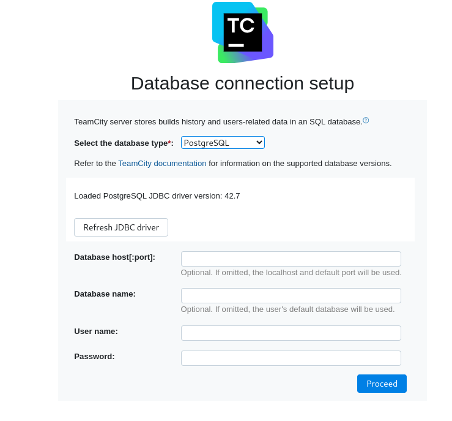
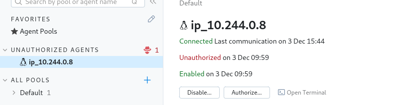
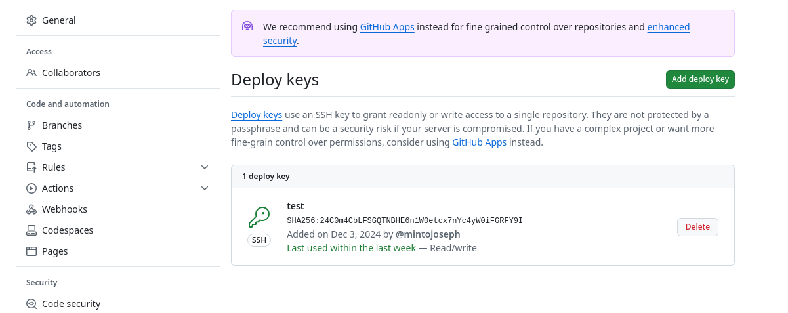
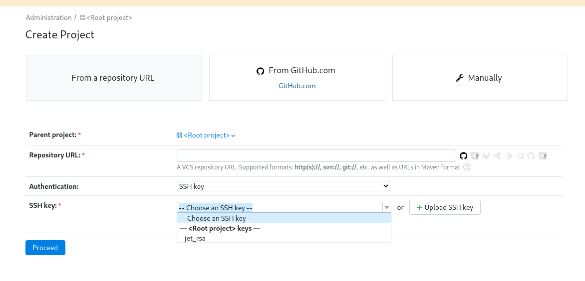
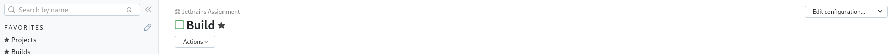
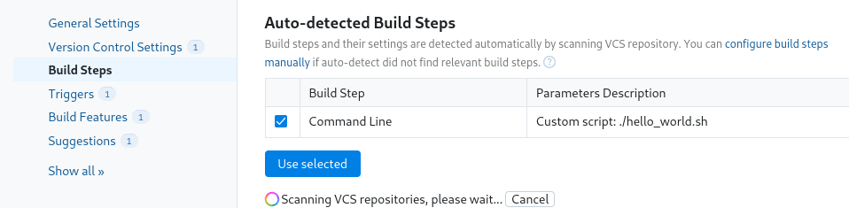
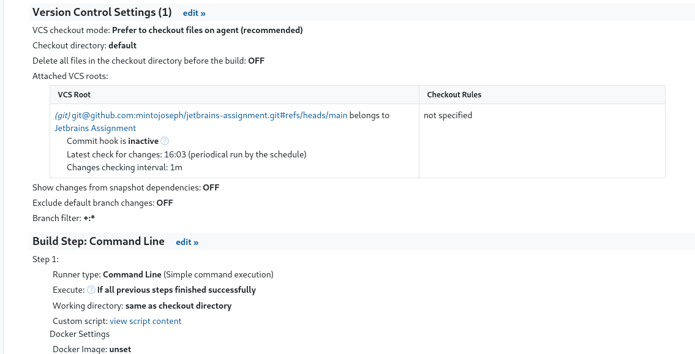
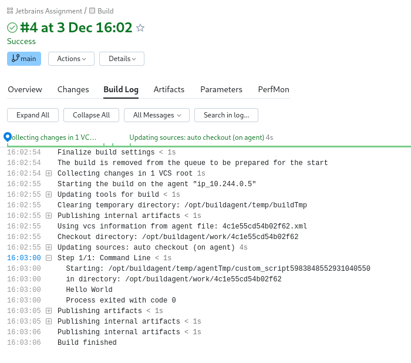

# TeamCity installation in Minikube

This guide will help to install and setup TeamCity components in a Minikube based kubernetes environment. The guide uses the source code available in the repository. Same repository is used as a test repository for validating the build process.

## System Requirements

A local machine with at least 10GB of RAM, 8 CPUs.

## Scope

This guide will only cover a basic test setup and will not get into the details of production grade deployment. Some of production grade aspects are mentions in todo list in he end.

## Technology used
* Fedora
* Docker
* kvm2
* Minikube
* GitHub
* Kubernetes
* TeamCity


## Setup Minikube

Set up Minikube with kvm2 as driver.

```
$ curl -LO https://storage.googleapis.com/minikube/releases/latest/minikube-latest.x86_64.rpm
$ sudo rpm -Uvh minikube-latest.x86_64.rpm
$ minikube start --cpus 4 --memory 10737 --driver=kvm2
```

Setup alias for kubectl.

```
alias kubectl="minikube kubectl --"
```


### Minikube debugging Notes


In Fedora 38, with the default driver qemu2, [minikube service and tunnel are not supported](https://github.com/kubernetes/minikube/issues/14146).


```
$ minikube profile list
|----------|-----------|---------|-----------|------|---------|---------|-------|----------------|--------------------|
| Profile  | VM Driver | Runtime |    IP     | Port | Version | Status  | Nodes | Active Profile | Active Kubecontext |
|----------|-----------|---------|-----------|------|---------|---------|-------|----------------|--------------------|
| minikube | qemu2     | docker  | 10.0.2.15 | 8443 | v1.26.1 | Running |     1 | *              | *                  |
|----------|-----------|---------|-----------|------|---------|---------|-------|----------------|--------------------|


$ minikube service teamcity-server
❌  Exiting due to MK_UNIMPLEMENTED: minikube service is not currently implemented with the builtin network on QEMU
$ minikube tunnel
❌  Exiting due to MK_UNIMPLEMENTED: minikube tunnel is not currently implemented with the builtin network on QEMU
```


A workaround is to use port forwarding along with node port.


```
apiVersion: v1
kind: Service
metadata:
 name: teamcity-server
spec:
 type: NodePort
 selector:
   app: teamcity-server
 ports:
 - port: 8111
   targetPort: 8111
   nodePort: 30001
```


```
$ kubectl port-forward svc/teamcity-server 8080:8111
```


With the KVM2 driver, the service and tunnel features are supported, and networking works flawlessly with bridging from localhost to the virtual network. In this documentation, Metallb is used to avoid dependency on Minikube for load balancing.


## Setup TeamCity Server and Agent


Use the Kubernetes manifest file to setup persistent volume for TeamCity.

```
$ kubectl apply -f pv-pvc.yaml
```

Create a TeamCity server with a service in load balancer mode.

```
$ kubectl apply -f teamcity-server.yaml
```

Deploy agent. A `SERVER_URL` environment variable is added to the agent deployment manifest with the service url for TeamCity server. `replicas` is used to specify the number of agents.

```
$ kubectl apply -f teamcity-agent.yaml
```

#### Agent scaling


Agents can be scaled using `kubectl scale deployment` command.


```
$ kubectl scale deployment teamcity-agent --replicas=3
```


[`kubectl autoscale deployment`](https://kubernetes.io/docs/reference/kubectl/generated/kubectl_autoscale/) can also be used to autoscale based of resource requirements.


## Setup PostgreSQL


Setup kubernetes native secrets for PostgreSQL. Secrets are base64-encoded and stored securely in etcd. While not fully encrypted by default, it helps to keep passwords from source code.

Note: A better way would be to use encrypted passwords using Kubernetes or a third-party provider.

```
$ kubectl create secret generic postgres-secret \
 --namespace=teamcity \
 --from-literal=POSTGRES_USER=teamcity \
 --from-literal=POSTGRES_PASSWORD=teamcitypassword \
 --from-literal=POSTGRES_DB=teamcitydb
```

## Setup Load Balancer

Metal load balancer allows to leverage load balancing capabilities without relying on Minikube. Install the minikube addon and create the configmap.

```
# minikube addons enable metallb
# kubectl apply -f metallb-config.yaml


$ kubectl get svc teamcity-server
NAME              TYPE           CLUSTER-IP      EXTERNAL-IP     PORT(S)          AGE
teamcity-server   LoadBalancer   10.98.100.117   192.168.39.50   8111:32257/TCP   19h
```

Use service external ip and 8111 port to access the TeamCity Server web UI.

```
$ kubectl get svc teamcity-server -o jsonpath='{.status.loadBalancer.ingress[0].ip}'
```

## Configure TeamCity WebUI

Download the PostgreSQL JDBC driver and pass database details using the TeamCity UI.




### Setup Agents

Agents need to be authorized from the list of unauthorized agents.



This will allow the agent to run the jobs.

[agent-auto-auth](https://plugins.jetbrains.com/plugin/14903-agent-auto-auth) plugin can be used to automatically authorize agents.


### Github integration

Create a new [ssh key pair](https://linux.die.net/man/1/ssh-keygen).

Set up the deploy key in the relevant Github repository.



In project section of TeamCity, add a project and set up the repository using the private ssh key for the authentication.



Click on "Edit configuration" on the Build.



Build Detect would have already found a Auto-detected custom script.



Review the Build details.



Verify the Results by pushing to the repository or manually running the pipeline.




## TODO

Following are some of the aspects which are not mentioned in this guide, but important for a production grade environment.

1. `RBAC (Role-Based Access Control)`
  * Ensure granular permissions for TeamCity server and agents in Kubernetes.
  * Add roles and role bindings specific to namespaces.

2. `Kubernetes Secrets Encryption, rotation and expiration`
* Enable encryption at rest for Kubernetes Secrets using encryptionConfig file. 
* Use tools like Sealed Secrets or External Secrets for dynamic secret management. 
* Integrate with secret management solutions like [HashiCorp Vault](https://www.vaultproject.io/) if needed.
3. `Monitoring`
* Integrate monitoring tools for visibility into TeamCity server and agents: Use [Prometheus and Grafana](https://prometheus.io/docs/visualization/grafana/) for metrics (e.g., CPU, memory, and pod health). Use [Fluentd](https://www.fluentd.org/) or [ELK stack](https://www.elastic.co/) for log aggregation.
* Monitor PostgreSQL using its built-in metrics and exporter.
4. `Better Build Pipeline`
* Introduce a CI/CD pipeline with reusable templates and modular build steps.
* Incorporate linting, security scans, and integration tests as pipeline steps.
5. `High Availability (HA) Setup`
* Use Kubernetes Horizontal Pod Autoscaler (HPA) for agents.
6. `Network security`
* Enable network policies to restrict communication between pods.
7. `Security scan`
* Regularly scan images for vulnerabilities using tools like [Trivy](https://github.com/aquasecurity/trivy).
8. `Scalability Testing`
* Test the scalability of agents and the server under high workloads.
9. `Disaster Recovery`
* Set up regular database backups using tools like [Velero](https://velero.io/) for Kubernetes cluster backups.
* Test restoration procedures periodically.
10.  `Cost Optimization`
* Optimize resource requests and limits for all pods.
* Use [kubecost](https://www.kubecost.com/) to analyse and report pod resource usage.